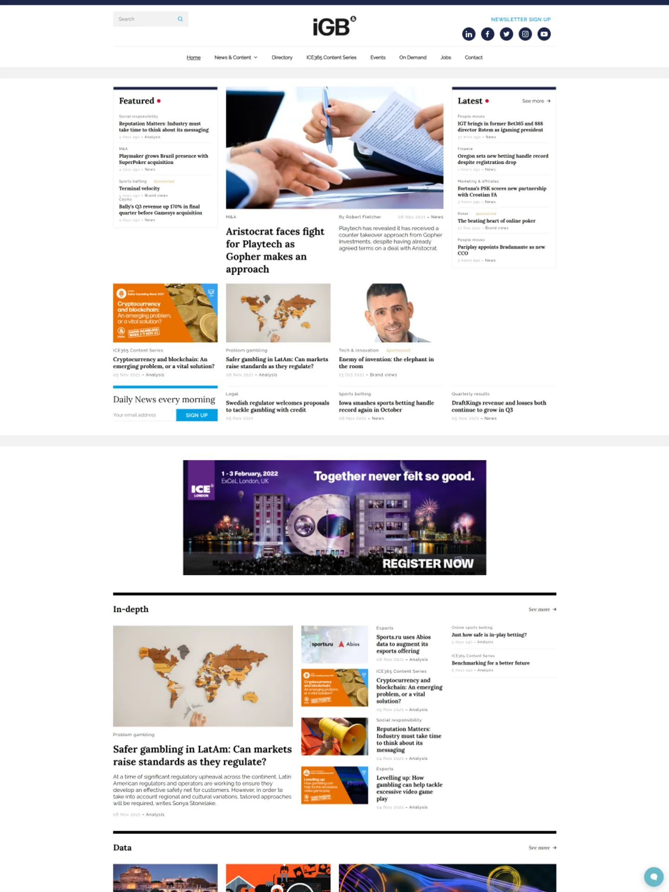

--- layout: default
--- title: Portfolio

📂 [Demos](README.md) | 💼 [Portfolio](PORTFOLIO.md)

# 💼 PORTFOLIO

## 🏢 Sage Advice

<table>
<tr>
<td width="40%">

</td>
<td width="60%" valign="top">

**Project Overview**

Sage needed a solution that would provide a centralised global blogging platform for 20+ different local markets that had multilanguage capabilities. Each region needed to be able to manage their own content, as well as having the ability to share and push content globally, when required.

🔗 **[View Project →](https://angrycreative.com/cases/sage-advice/)**

</td>
</tr>
</table>

---

## ⚡ Lindy Electronics

<table>
<tr>
<td width="60%" valign="top">

**Project Overview**

Using the new WordPress editor, Gutenberg, to develop a global brand experience for industry leaders Lindy Electronics.

🔗 **[View Project →](https://angrycreative.com/cases/lindy-electronics/)**

</td>
<td width="40%">

</td>
</tr>
</table>

---

## 🌐 Bonnet Multisite Network

<table>
<tr>
<td width="40%">

</td>
<td width="60%" valign="top">

**Project Overview**

A comprehensive WordPress multisite network solution for Bonnet and their subsidiary brands. Implemented custom child themes for each site whilst maintaining a shared parent theme architecture for consistent functionality and efficient maintenance.

**Key Sites:**
- 🚜 **[Bonnet.se](https://www.bonnet.se/)** - Main agricultural machinery site with VAT switcher
- 🌾 **[Nordfarm.se](https://nordfarm.se/)** - Nordic farming equipment specialist  
- ⚙️ **[X-Maskiner.se](https://x-maskiner.se/)** - Industrial machinery division

**Technical Implementation:**
- 🎨 **Custom Child Themes** for brand-specific designs
- 🏗️ **Shared Parent Theme** for core functionality
- 🔄 **VAT Switcher Integration** for B2B pricing flexibility
- 🌐 **Multisite Management** across multiple domains

🔗 **[View Project →](https://angrycreative.com/cases/bonnet/)**

</td>
</tr>
</table>

---

## 🎮 IGB

<table>
<tr>
<td width="40%">

</td>
<td width="60%" valign="top">

**Project Overview**

Extend the existing igamingbusiness.com site to add features and functionality, notably around a logged in user experience and create a multisite network that also supported two other brands within the gaming division.

🔗 **[View Project →](https://angrycreative.com/cases/igaming-business/)**

</td>
</tr>
</table>

---

## 💅 Treatwell

<table>
<tr>
<td width="60%" valign="top">

**Project Overview**

Design and build. Treatwell is one of the U.K.'s biggest online spa & salon software providers giving beauty business owners an online booking app for a monthly subscription fee.

🔗 **[View Project →](https://angrycreative.com/cases/treatwell/)**

</td>
<td width="40%">

</td>
</tr>
</table>
---

## 📈 Eminova Partners

<table>
<tr>
<td width="40%">

</td>
<td width="60%" valign="top">

**Project Overview**

We helped Eminova Partners create a very smooth solution that digitises Eminova Partners' processes and provides the end customer with a simplified way to participate in the opportunities Eminova Partners can present to their clients.

🔗 **[View Project →](https://angrycreative.com/cases/eminova-partner-select/)**

</td>
</tr>
</table>

---

## 🛡️ Sentric Safety Group

<table>
<tr>
<td width="60%" valign="top">

**Project Overview**

Design and build. Sentric Safety Group's project showcased innovative solutions that significantly elevated their online platform. The implementation of a WooCommerce catalogue empowered users to effortlessly access, download, and share product datasheets. Notably, the use of WPForms helped transform forms into accessible webpages and ensured seamless client access to crucial schematics.

🔗 **[View Project →](https://angrycreative.com/cases/sentric-safety-group/)**

</td>
<td width="40%">

</td>
</tr>
</table>

---

## 🪨 Granit & Marmor

<table>
<tr>
<td width="40%">

</td>
<td width="60%" valign="top">

**Project Overview**

Check out how we aided Granit & Marmor in simplifying their purchase process, propelling them towards a more digital, efficient, and customer-centric delivery model.

🔗 **[View Project →](https://angrycreative.com/cases/granit-marmor/)**

</td>
</tr>
</table>

---

## 🐎 Equestrian Stockholm

<table>
<tr>
<td width="60%" valign="top">

**Project Overview**

Equestrian Stockholm is an exclusive equestrian brand that combines style, quality, and sustainability. Their range of riding equipment, saddle pads, and horse accessories reflects their commitment to high-quality craftsmanship and unique designs inspired by nature. With an ambition to become an industry leader in equestrian fashion, where e-commerce is their primary sales channel, the need for a stable and functional website that reflects their market position became clear.

🔗 **[View Project →](https://angrycreative.com/cases/equestrian-stockholm/)**

</td>
<td width="40%">

</td>
</tr>
</table>

---

## 🌲 TimberTech

<table>
<tr>
<td width="40%">

</td>
<td width="60%" valign="top">

**Project Overview**

WooCommerce customisation for products and variations. Product Display Pages. Order sample search page and modals. Bundled products. *"Find Your Colors"* - custom hero block with slider for choosing colours with filters.

🔗 **[View Project →](https://www.timbertech.com/)**

</td>
</tr>
</table>

---

## 📚 Discovery Education - Egyptian Knowledge Bank

<table>
<tr>
<td width="60%" valign="top">

**Project Overview**

Welcome to Discovery Education - Egyptian Knowledge Bank. The Egyptian Knowledge Bank is a English/Arabic website, which leveraged existing templates and components to enable building this site in short time.

🔗 **[View Project →](https://www.dailynewsegypt.com/2017/04/26/discovery-education-deploys-technology-egyptian-knowledge-bank/)**

</td>
<td width="40%">

</td>
</tr>
</table>

---

## ❓ Discovery Education - Help Centre

<table>
<tr>
<td width="40%">

</td>
<td width="60%" valign="top">

**Project Overview**

Discovery Education UK Help Centre. Creating and establishing a network of user-generated help sites and providing support to users with one-to-one or group tutorials, wiki documentation and written guides.

🔗 **[View Project →](https://help.discoveryeducation.co.uk/hc/en-gb)**

</td>
</tr>
</table>

---

## 🌐 Discovery Education - Promotional Website

<table>
<tr>
<td width="60%" valign="top">

**Project Overview**

Promotional website for Discovery Education UK. As lead developer on the enterprise CMS, I architected and created scalable, component-based templates with Responsive Web Design. This enabled the marketing department to create hundreds of content-driven pages and custom features including mastheads, hero banners, dynamic columns and grid layouts, video indexes, tabbed content areas, and grouped indexing.

🔗 **[View Project →](https://www.discoveryeducation.co.uk/)**

</td>
<td width="40%">

</td>
</tr>
</table>

---

## 🎯 Discovery Education - Spotlight on Strategies

<table>
<tr>
<td width="40%">

</td>
<td width="60%" valign="top">

**Project Overview**

Discovery Education's Spotlight on Strategies. Component template for index feature with filters and icons.

🔗 **[View Project →](https://www.discoveryeducation.co.uk/spotlight-on-strategies/)**

</td>
</tr>
</table>

---

## 🇸🇪 Espresso Education - Swedish Edition

<table>
<tr>
<td width="60%" valign="top">

**Project Overview**

Localisation of Espresso Education for Swedish publisher Liber.

🔗 **[View Project →](https://www.liber.se/digitala-laromedel/discovery-espresso)**

</td>
<td width="40%">

</td>
</tr>
</table>

---

   
  
<em>Built with ❤️ and cutting-edge web technologies</em>

  
  

