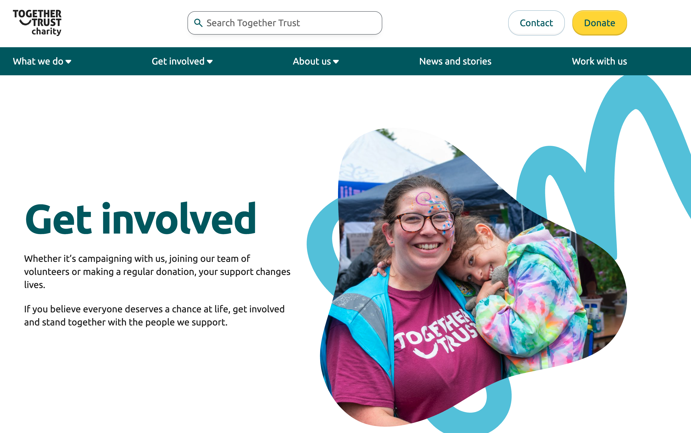

# ⌣ Together Trust -

## Overview

A comprehensive WordPress multisite network solution for Bonnet and their subsidiary brands. Implemented custom child themes for each site whilst maintaining a shared parent theme architecture for consistent functionality and efficient maintenance.

I scoped and built a custom block to enable users to choose to see product prices including or excluding tax, across the complete e-commerce flow.

## Key Sites

- 🚜 **[Bonnet.se](https://www.bonnet.se/)** - Main agricultural machinery site with VAT switcher
- 🌾 **[Nordfarm.se](https://nordfarm.se/)** - Nordic farming equipment specialist
- ⚙️ **[X-Maskiner.se](https://x-maskiner.se/)** - Industrial machinery division

## Technical Implementation

- 🎨 **Custom Child Themes** for brand-specific designs
- 🏗️ **Shared Parent Theme** for core functionality
- 🌐 **Multisite Management** across multiple domains
- 🔄 **VAT Switcher Integration** for B2B pricing flexibility

## Key Features

- WordPress Multisite Network architecture
- Custom VAT switcher block (inc/exc tax pricing)
- Child theme architecture for brand customization
- Shared parent theme for core functionality
- WooCommerce integration
- Cross-site content management

## Technologies Used

- WordPress Multisite
- PHP (Object-Oriented Programming)
- WooCommerce
- Custom Gutenberg Blocks
- Child/Parent Theme Architecture
- MySQL

🔗 **[View Case Study →](https://angrycreative.com/cases/bonnet/)**

---

[← Back to Portfolio](../portfolio.md)
